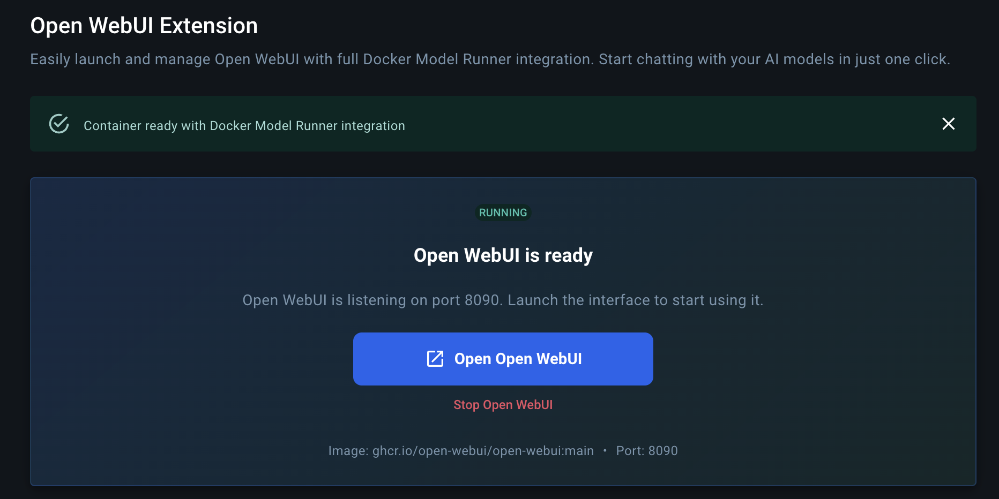
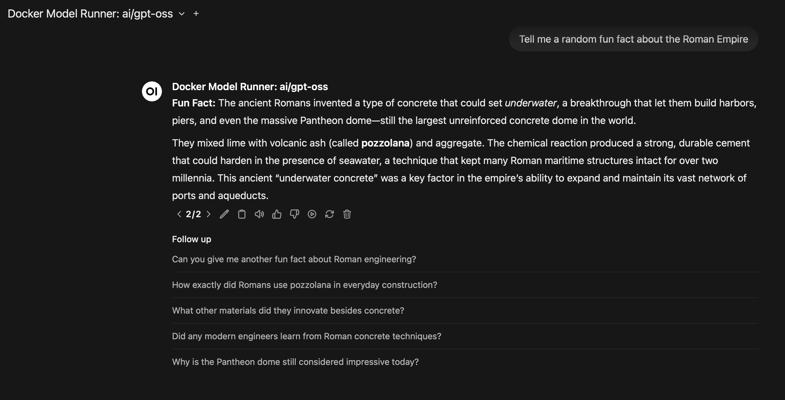

# Open WebUI Docker Extension

Give Docker Model Runner a welcoming home inside Docker Desktop. This extension delivers a one-click Open WebUI experience with all its rich tools and features and without ever touching the command line.

## Why use it?
- **Instant sandbox** – Launch Docker Model Runner with Open WebUI in seconds, right from Docker Desktop.
- **Familiar interface** – Open WebUI is a community favourite, packed with multi-provider support, chat history, documents, voice features, and more.
- **Guided experience** – Clear status updates, built-in health checks, and automatic container recreation keep everything running smoothly.
- **No surprises** – Image and port settings come with sensible defaults, validation, and persistent storage so you can pick up where you left off.
- **Ready for everyone** – Perfect for trying Open WebUI + DMR locally, showcasing to teammates, or giving non-engineers a friendly way to experiment.

## What you get out of the box
- A preconfigured Open WebUI container that can talk to Docker Model Runner on your machine.
- One-click controls to start, stop, restart, and open the UI.
- Automatic volume management so your conversations, uploads, and settings stay put between sessions.
- Browser launch shortcuts so you can jump straight into Open WebUI when the container is ready.

## Requirements
- Docker Desktop 4.x or later with Extensions enabled.
- Internet access the first time you pull the Open WebUI image.
- Sufficient disk space and RAM for the models you plan to load via Docker Model Runner.

## Install from Docker Desktop
1. Open Docker Desktop and sign in if prompted.
2. Go to **Extensions** → **Marketplace**.
3. Search for **“Open WebUI Docker Extension”** and click **Install**.
4. Once installed, open the extension from the left-hand navigation.

## Launch your first session
1. Press **Start** to create (or recreate) the Open WebUI container with recommended defaults.
2. Wait for the status indicator to turn green, then click **Open** to launch Open WebUI in your browser.
3. Choose a model exposed by Docker Model Runner, or connect additional providers from Open WebUI’s settings.
4. Explore chats, embeddings, voice commands, document uploads, and custom workflows—all powered by Docker Model Runner.

Want to tweak the image tag or listen on another port? Adjust the settings panel before you press **Start**. The extension validates your choices and remembers them for next time.

## See it in action

## Everyday tips
- **Auto-start** keeps things simple: leave it on to have the extension create and run the container whenever you visit.
- **Multiple models**: Switch between Docker Model Runner deployments or add third-party providers directly within Open WebUI.
- **Data safety**: Volumes named `open-webui-docker-extension-*` hold your workspace data. Delete them from Docker Desktop if you ever want a clean slate.

## Troubleshooting
- Container stuck on starting? Check that the chosen port isn’t already in use and that Docker Desktop has resources available.
- Can’t reach the browser view? Make sure the container shows a green “Running” badge, then click **Open** again.
- Seeing validation warnings? Adjust the image name or port according to the hint shown in the settings panel.
- Need container logs? Open the container from Docker Desktop → **Containers** and review the logs tab for detailed output.

## Need help or want to share feedback?
Open an issue in this repository with any questions, ideas, or screenshots. We’d love to hear how you’re using the extension to explore Docker Model Runner with Open WebUI.

## License
This project is open source and available under the [Apache License 2.0](LICENSE).
